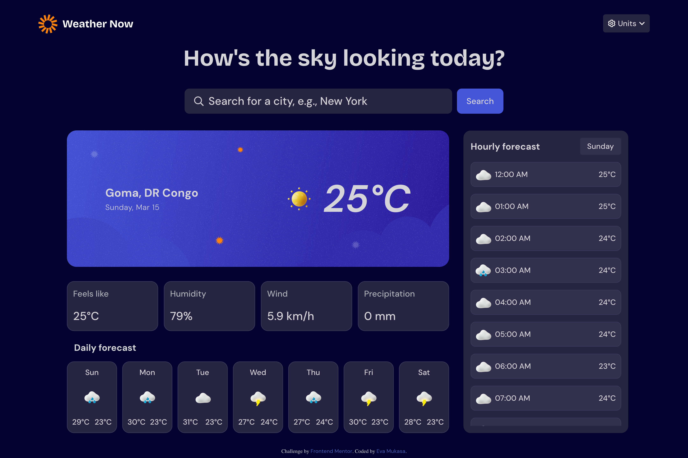
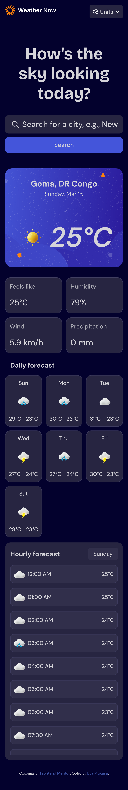

# Frontend Mentor - Weather App Solution

This is my solution to the **Weather App challenge** on Frontend Mentor.  
The goal of this project was to build a responsive weather application that fetches real-time weather data from an API and displays it in a clean and interactive interface.

Frontend Mentor challenges help developers improve their coding skills by building realistic projects.

---

# Table of contents

- [Overview](#overview)
  - [The challenge](#the-challenge)
  - [Screenshots](#screenshots)
  - [Links](#links)
- [My process](#my-process)
  - [Built with](#built-with)
  - [What I learned](#what-i-learned)
  - [Continued development](#continued-development)
  - [AI Collaboration](#ai-collaboration)
- [Author](#author)

---

# Overview

## The challenge

Users should be able to:

- Search for weather information by entering a **location**
- View **current weather conditions**
- See the **temperature, weather icon, and location**
- View additional weather metrics such as:
  - humidity
  - wind speed
  - precipitation
- Browse a **7-day weather forecast**
- View an **hourly forecast**
- Switch between **Celsius and Fahrenheit**
- Experience a **fully responsive layout**
- See **hover and focus states** for interactive elements

The weather data is fetched using the **Open-Meteo API**.

---

# Screenshots

### Desktop



### Mobile



---

# Links

**Live Site**  
https://freedev-group.github.io/Weather_App-Evelyne/

**Frontend Mentor Solution**  
(Add your solution link here if you posted it)

---

# My process

## Built with

- Semantic **HTML5**
- **CSS3**
- **Flexbox**
- **CSS Grid**
- **Mobile-first workflow**
- **Vanilla JavaScript**
- **Fetch API**
- **Open-Meteo Weather API**

---

# What I learned

This project helped me improve several important frontend development skills.

During this challenge I practiced:

- Fetching weather data from an API
- Using **async/await** with JavaScript
- Dynamically updating the **DOM**
- Creating responsive layouts with **CSS Grid**
- Handling **user input and search functionality**
- Building a structured **weather interface**

Example of fetching data:

```javascript
async function fetchForecast(lat, lon) {
  const params = new URLSearchParams({
    latitude: lat,
    longitude: lon,
    current_weather: "true",
    timezone: "auto"
  });

  const response = await fetch(`https://api.open-meteo.com/v1/forecast?${params}`);
  const data = await response.json();

  return data;
}
```

---

# Continued development

In future projects I want to continue improving:

- My **JavaScript architecture**
- **Error handling** for API requests
- Creating **reusable UI components**
- Adding **animations and micro-interactions**
- Learning modern frameworks like **React**

---

# AI Collaboration

During this project I used **ChatGPT** as a learning assistant.

It helped me with:

- Debugging JavaScript issues
- Improving CSS layouts
- Understanding API responses
- Structuring the project
- Improving the documentation

---

# Author

**Evelyne Mukasa**

Frontend Mentor  
https://www.frontendmentor.io/profile/evelynmukasa

Live Project  
https://freedev-group.github.io/Weather_App-Evelyne/